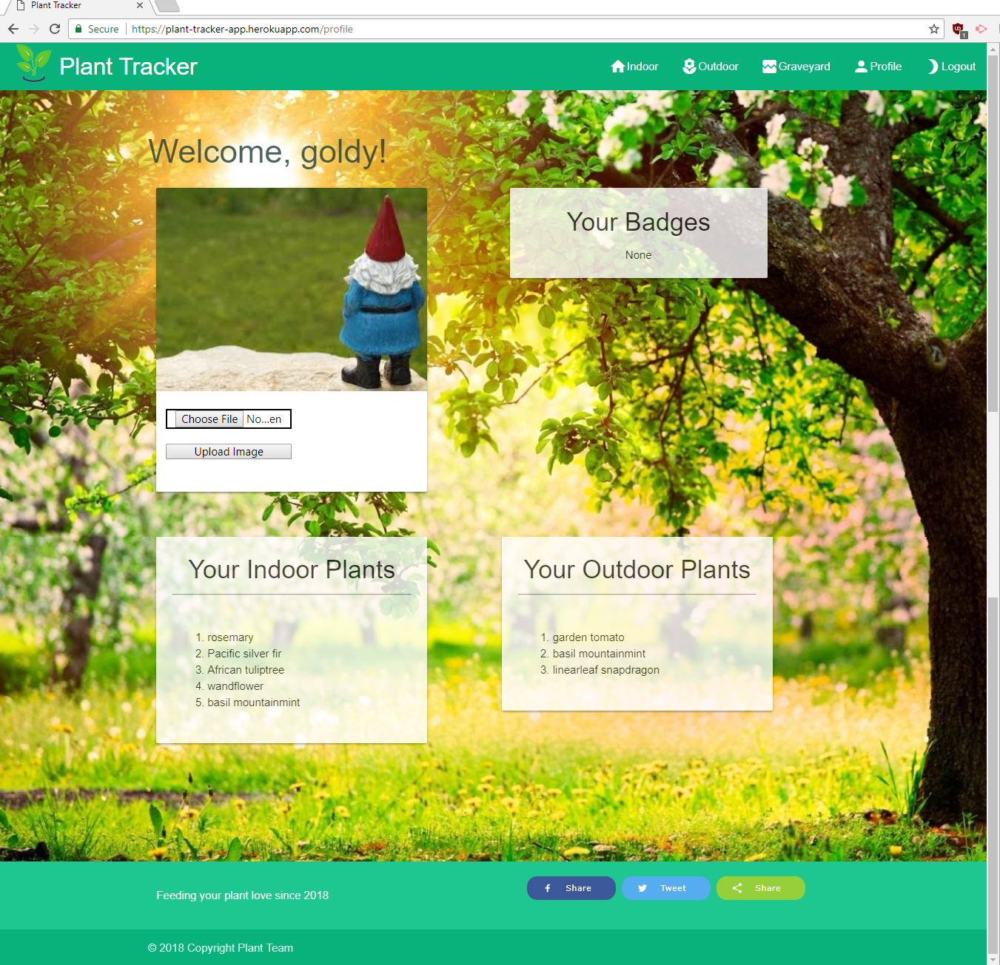

# Plant Tracker Application
---
## About
An elegant, visually appealing way to track plant health, watering schedule, and whether plant is Indoor :house: or Outdoor :tulip:.  The plant could also hav died and can be found in the Graveyard :skull:.   

######Key other features:
* Passport encrypted Username and Password for each plant owner
* Text message sent to owner when plant needs to be watered via Node-mailer
* Common plant name lookup in USDA Plant data which is stored in a local DB table
* Users that are not logged which are attempting to access other URLs on the web page are redirected to the login screen for any other URL on the web sites (example `https://plant-tracker-app.herokuapp.com/profile` -> `https://plant-tracker-app.herokuapp.com/`)
* Image displayed looking out of the window when inside of the house is set based on the current weather using the plant owners zip code

## Motivation
Create a project that demonstrates a multitude of technologies available for current full stack applications.
In particular, we chose to design a REACT based web-site that presented a 'Single-Page App' to the plant owner.  A key feature we incorported was encrypted password authentication using Passport.  The REACT front-end was woven together with a Node.js based backend that leveraged a Sequelize ORM->MySQL DB.

## Live Link 
https://plant-tracker-app.herokuapp.com/

## Technologies Used
REACT, Materialize, JavaScript ES6, Passport User Authentication, CSS, JSON, MySQL, Sequelize, Express, Node.js, body-parser, OpenWeatherMap API

* Note *:  The entire USDA Plant DB was not able to be loaded into the MySQL-JawsDB used to deploy the app due to DB size limitations based on cost.

## Collaborators 
Cecelia Clohisy

Edwin Hsia

Brittany Greaner

Rachel Greaner

Martin Guldberg

Carolyn Smith

## Screen Shots

### Login Page

### Profile Page

### Indoor Page

### Outdoor Page

### Graveyard Page

